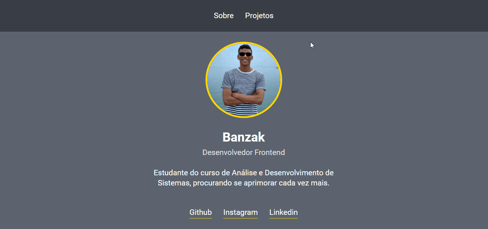

<h1 align="center">
  
Portfólio

</h1>

  <a href="#-tecnologias">Tecnologias</a>&nbsp;&nbsp;&nbsp;|&nbsp;&nbsp;&nbsp;
  <a href="#-projeto">Projeto</a>&nbsp;&nbsp;&nbsp;|&nbsp;&nbsp;&nbsp;

 

  

## 🚀 Tecnologias

Esse projeto está sendo desenvolvido com as seguintes tecnologias:

- HTML
- CSS
- JavaScript

 

## 💻 Projeto

O é um site portifólio no qual reúne todos meu projetos mais importantes.

---

Feito com ♥ by Banzak